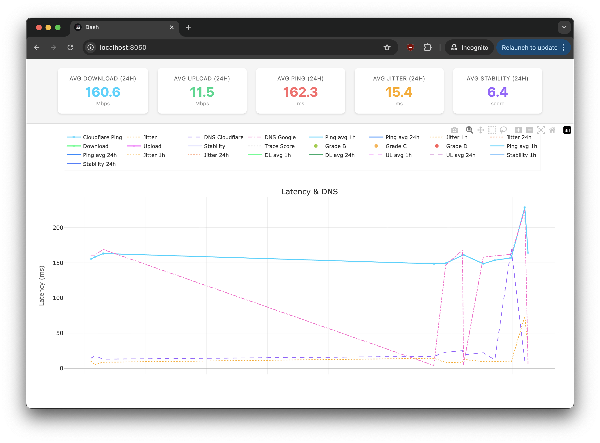

# 📡 Network Monitor



Automated internet quality monitoring tool that tracks latency, jitter, packet loss, download/upload speeds, and connection stability over time. Perfect for diagnosing ISP issues, VPN performance, or network reliability.

```sh
=== 📡 Internet Quality Snapshot ===
🕒 Timestamp      : 2025-11-18T05:42:52.746Z
🏷️  Provider      : Tele2
🛡️  VPN           : on
📶 Online         : YES

--- 🔁 Ping Measurements (ms) ---
Router         avg=3.30 ms | jitter=0.34 ms | loss=0.00 %
Google         avg=153.92 ms | jitter=6.08 ms | loss=0.00 %
Cloudflare     avg=153.70 ms | jitter=9.91 ms | loss=0.00 %

--- 🚀 Speedtest ---
Download       : 170.29 Mbps (21.29 MBs)
Upload         : 4.49 Mbps (0.56 MBs)
Server Latency : 162.25 ms
Idle Jitter    : 7.99 ms
DL Jitter      : 18.81 ms
UL Jitter      : 7.33 ms

--- 🔌 Interface Info ---
Router IP      : 192.168.8.1

--- 📊 Stability ---
Stability Score : 100 / 100
Stability Level : Excellent
Meaning         : Very stable connection with low latency variation and strong throughput.

--- 🧭 Traceroute Health ---
Trace Score     : 45 / 100
Trace Issues    : High latency on first hop (VPN tunnel or local signal)

--- Route Hops ---
Hop 2: avg=149.09 ms
Hop 3: avg=149.84 ms
Hop 4: avg=162.83 ms
Hop 5: avg=147.25 ms

--- 🌐 DNS Lookup ---
Cloudflare DNS : 12 ms
Google DNS     : 160 ms

--- 🌍 HTTP TTFB ---
Cloudflare TTFB: 577 ms

=== 🧠 Network Health Summary ===
Overall Grade    : C
Main Issues      : Moderate latency; Slow DNS resolution; Routing instability detected
Recommendation   : Slow DNS — configure Cloudflare DNS (1.1.1.1) in your VPN settings.
```

## 💡 Why This Project?

After experiencing frequent 5G dropouts and inconsistent speeds, I needed concrete data to hold my ISP accountable. Unlike one-off speedtests that can be dismissed as "temporary issues," continuous monitoring reveals the truth: patterns of congestion, routing problems, and service quality variations.

## ✨ Features

- 📊 **Metrics**: Ping, jitter, packet loss, DNS, HTTP TTFB, download/upload speeds
- 🎯 **Stability Scoring**: Smart algorithm evaluating overall connection quality (0-100 scale)
- 📈 **Rolling Averages**: 1-hour and 24-hour windows for trend analysis
- 🏥 **Health Grading**: Automatic A-F grading with actionable recommendations
- 🗺️ **Traceroute Analysis**: First-hop diagnostics and routing path evaluation
- 🏠 **Home Network Detection**: MAC-based detection to skip runs when not on home WIFI
- 📉 **Interactive Dashboard**: Beautiful Plotly Dash visualizations with real-time metrics
- ⚙️ **Automated Scheduling**: Run via macOS LaunchAgent at configurable intervals
- 🔒 **Privacy-First**: All data stays local, no external reporting

### 🚀 Speed Test Implementation

Uses **Cloudflare's speedtest** (via Puppeteer) instead of Ookla for realistic measurements:

- **Real-world accuracy**: Measures actual usable speed under typical browsing conditions, not artificially optimized bursts
- **No preferential routing**: ISPs often prioritize Ookla traffic. Cloudflare reflects actual internet performance
- **Performance Timing API**: Runs in Puppeteer to provide access to browser APIs for accurate latency/jitter metrics unavailable in Node.js

> **Note**: ICMP packet loss is measured via `ping`. Speedtest packet loss requires manual TURN server configuration (not implemented).

## 📋 Requirements

Note: Some manual setup or tweaking is required in different environments.

### System Dependencies

- **Ttested on macOS**
- **Node.js** 16+ ([Download](https://nodejs.org/))
- **Python** 3.11+ ([Download](https://www.python.org/)) _optional_
- Standard Unix tools: `ping`, `traceroute`, `arp`, `netstat`

### Node.js Dependencies

```bash
npm install
```

### Python Dependencies

_Optional, but required for viewing the chart dashboard_

```bash
pip install dash plotly
```

- `dash` - Interactive web dashboard framework
- `plotly` - Visualization library

## 🚀 Quick Start

### 1. Clone and Install

```bash
git clone https://github.com/ricklancee/netmonitor.git
cd netmonitor
npm install
pip install dash plotly
```

### 2. Configure Environment

Copy `.env.example` to `.env` and fill in your values:

```bash
cp .env.example .env
```

Edit `.env`:

```env
# Your router IP (for ping tests)
HOME_ROUTER_IP=192.168.1.1

# Your router MAC address (for home network detection - required)
HOME_ROUTER_MAC=aa:bb:cc:dd:ee:ff

# Your ISP name (for filtering in dashboard)
PROVIDER=My ISP Name

# VPN status (on/off or server name)
VPN=off
```

#### Finding Your Router IP and MAC Address

**Router IP:**

```bash
# macOS/Linux
netstat -rn | grep default
# Look for the IP in the "Gateway" column (usually 192.168.x.x or 10.0.x.x)

# Or check your network settings:
# macOS: System Settings → Network → (your connection) → Details → Router IP
```

**Router MAC Address:**

```bash
# macOS - First, ping your router to populate ARP cache
ping -c 1 192.168.1.1  # Replace with your router IP

# Then check the ARP table
arp -a | grep "192.168.1.1"
# Look for the MAC address in format: aa:bb:cc:dd:ee:ff

# Alternative: Check your router's admin panel
# Usually accessible at http://192.168.1.1 or http://192.168.0.1
# Look for "LAN MAC Address" or "Device MAC" in system/status pages
```

### 3. Test Run

```bash
npm start
```

Or dry-run (no logging to files):

```bash
npm run start:dry
```

### 4. View Dashboard

```bash
npm run plot
```

Opens interactive dashboard at `http://localhost:8050` 🎉

## ⏰ Automated Scheduling (macOS)

**Optional**: Set up a LaunchAgent to run network monitoring automatically every 15 minutes in the background. This allows you to collect data continuously without manual intervention.

### Setup LaunchAgent

1. Edit `com.netmonitor.agent.plist`:

   - Replace `WRITE_NODE_PATH_HERE` with your Node.js path (run `which node`)
   - Replace `WRITE_NET_MONITOR_DIRECTORY_HERE` with the full path to this project

2. Copy to LaunchAgents:

   ```bash
   cp com.netmonitor.agent.plist ~/Library/LaunchAgents/
   ```

3. Load the agent:
   ```bash
   npm run launchctl:bootstrap
   ```

### Management Commands

```bash
npm run launchctl:check      # Check if running
npm run launchctl:kickstart  # Run immediately
npm run launchctl:bootout    # Stop the agent
npm run launchctl:reset      # Restart everything
```

Default interval: **15 minutes** (900 seconds)

## 📊 Output

### CSV Log

Data is saved to `logs/net_monitor.csv` with columns:

- Timestamp, provider, VPN status, online status
- Router/Google/Cloudflare ping stats (avg, jitter, packet loss)
- Speedtest results (download, upload, ping, jitter metrics)
- Stability score, DNS timings, HTTP TTFB
- Rolling averages (1h, 24h)
- Health grade, trace score

### Dashboard Metrics

The interactive dashboard shows:

- 📈 **Latest 24h Averages**: Download, upload, ping, jitter, stability
- 📉 **Time-Series Charts**:
  - Latency & DNS performance
  - Download/Upload speeds
  - Stability & trace scores
  - Rolling averages (1h/24h windows)

Filter by provider with `--provider` flag:

```bash
python plot_net_logs.py logs/net_monitor.csv --provider "My ISP"
```

## 🔧 Configuration

### Environment Variables

| Variable          | Default                  | Description                           |
| ----------------- | ------------------------ | ------------------------------------- |
| `HOME_ROUTER_IP`  | `192.168.1.1`            | Your router's IP address              |
| `HOME_ROUTER_MAC` | _(none)_                 | Router MAC for home detection         |
| `PROVIDER`        | _(empty)_                | ISP name for logging                  |
| `VPN`             | _(empty)_                | VPN status/server name                |
| `PING_COUNT`      | `5`                      | Number of pings per test              |
| `PING_TIMEOUT_MS` | `15000`                  | Ping timeout in milliseconds          |
| `NO_SPEEDTEST`    | `0`                      | Set to `1` to skip speedtest          |
| `DRY_RUN`         | `false`                  | Set to `true` to test without logging |
| `OLLAMA_ENABLED`  | `false`                  | Enable AI analysis with Ollama        |
| `OLLAMA_ENDPOINT` | `http://localhost:11434` | Ollama API endpoint                   |
| `OLLAMA_MODEL`    | `llama3.1:8b`            | Ollama model to use for analysis      |

### Provider Comparison & AI Analysis

The `analyze_providers.cjs` script analyzes network performance data from your monitoring logs:

```bash
npm run analyze  # Analyzes logs/net_monitor.csv
```

**Features:**

- 📊 **Single Provider Mode**: Evaluates overall network quality, identifies strengths/weaknesses
- 🆚 **Comparison Mode**: Head-to-head comparison when you have data from 2 or more providers
- 📈 Statistical analysis with mean, median, std dev, percentiles (15 metrics)
- 🤖 **AI-powered insights** with Ollama (optional)
- 📝 Generates markdown reports with tables and detailed statistics

**How It Works:**

The script automatically detects the number of providers in your data:

- **1 Provider**: Generates a comprehensive performance report analyzing speed, latency, jitter, packet loss, and stability. AI provides actionable recommendations for your specific network.
- **2+ Providers**: Creates a comparison showing which provider wins each metric. AI analyzes which is better for your usage patterns (programming, video calls, gaming, etc.) and provides specific recommendations.

**Output Files:**

- Single provider: `provider_analysis.md` (stats + AI insights if enabled)
- Multiple providers: `provider_comparison.md` (comparative stats for all providers + AI insights if enabled)

**AI Analysis Setup:**

1. Install [Ollama](https://ollama.ai/)
2. Pull a model: `ollama pull llama3.1:8b`
3. Configure in `.env`:
   ```env
   OLLAMA_ENABLED=true
   OLLAMA_ENDPOINT=http://localhost:11434
   OLLAMA_MODEL=llama3.1:8b
   ```
4. Run analysis: `npm run analyze`

To disable AI analysis, set `OLLAMA_ENABLED=false` in `.env`. The script will still generate statistical comparison reports.

**Supported Models:**

- `llama3.1:8b` (recommended)
- `llama3.2` (faster, less detailed)
- `mistral` or any Ollama-compatible model

### Thresholds

All scoring thresholds are configurable in `index.cjs` under `CONFIG.STABILITY` and `CONFIG.HEALTH`. Adjust these based on your connection type (fiber/cable/5G/VPN).

## 🎯 Use Cases

- 📞 **ISP Accountability**: Document connection issues with timestamped data
- 🔍 **VPN Comparison**: Compare stability across different VPN servers
- 📶 **5G vs Fiber**: Track performance differences between connections
- 🏠 **Home vs Mobile**: See how your connection varies by location
- 🛠️ **Troubleshooting**: Identify patterns in network degradation

## 🤝 Contributing

Issues and PRs welcome! This is a personal monitoring tool that's been made generic for public use.

## ⚠️ Privacy Note

All monitoring data stays **local on your machine**. No data is sent to external services except for the tests themselves (Cloudflare speedtest, DNS lookups, etc.). Review the code before use if privacy is a concern.

---

**Made with 💻 by [Rick Lancee](https://github.com/ricklancee)**
